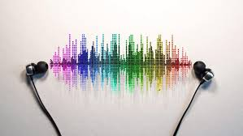

<p align="center">
  
</p>
<p align="center">
  <strong>Music Listening Behaviour Analytics Dashboard.</strong>
</p>
<p align="center">
  Gain insights into how users interact with your music app — which songs trend, what time users are most active, and which artists dominate the charts.
</p>

---
## Table of Contents

1. [Key Features](#Key-Feature)
2. [Project Motivation](#project-motivation)
3. [Project Structure](#Project-Structure)
3. [How to run](#How-to-run)
5. [Example Output](#Example-Output)
6. [Licensing, Authors, and Acknowledgements](#licensing-authors-and-acknowledgements)

## Key Features

- **Top Trending Songs**: See what tracks are most popular across all users.
- **Listening Frequency by Hour**: Identify peak engagement hours throughout the day.
- **Play Count by Track**: Understand how often individual songs are played.
- **User Recommendation Engine**: Built-in logic suggests songs based on play history.

---

## Project Motivation

This project is intended to visualize how users engage with a music app in real-time — providing developers, product owners, and artists with actionable analytics.

---

## 📦 Project Structure

```plaintext
├── index.html              # Web interface for player + charts
├── style.css               # Custom CSS styling
├── main.js                 # Logic for chart rendering and interactivity
├── data/
│   └── musicData.json      # Contains play count, song metadata, and timestamps
└── README.md               # This documentation file
```

---

## How to Run

1. **Install dependencies** (optional if using raw HTML):
- Install live server in extension of VS Code
- Choose index.html and "Go live"
---
- HTML, CSS (Flexbox)
- JavaScript
- [Chart.js](https://www.chartjs.org/) for data visualization

---

## Example Output

### 1. Top 5 Songs Trending

| Song              | Artist       | Plays |
|-------------------|--------------|-------|
| Nevadar           | Vicetone     | 45    |
| Wake Me Up        | Avicii       | 10    |
| Waiting For Love  | Avicii       | 10    |
| Pay Phone         | Maroon 5     | 8     |
| Memories          | Maroon 5     | 7     |

### 2. Listening Frequency by Hour

| Time (Hour) | Plays |
|-------------|-------|
| 14:00       | 63    |
| 15:00       | 12    |
| ...         | ...   |

---

## Licensing, Authors, and Acknowledgements

Developed by Kien Tran  
